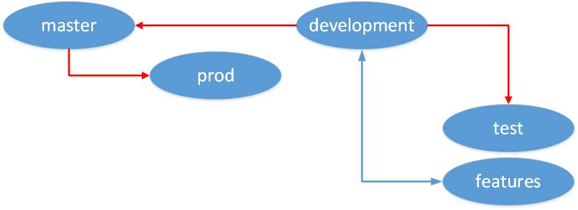

# Saltstack configuration repository

Mostly I'm learning Saltstack, or the management of a Saltstack repository.

## Branches

Salt Masters can use git-backed file storage, so it makes sense to protect
branches that match environment names, or stages in the development lifecycle.

The three environment branches (prod, staging, test) are protected, 
and can only be merged into from their respective upstreams.  Meanwhile, 
master can only be merged into from development through a pull request.

When adding new features, checkout a new branch from development, and
merge that branch through a pull request when complete.  At this stage,
you're ready to deploy to test.

When all features necessary for the next release have been made, merge 
the development branch into master.  Then merge master into staging.
When servers in the staging environment have been configured, you're ready
for integration testing.

When integration tests are OK and we have approved a deployment to 
production, merge master into production, and optionally create a Git tag
incrementing the release version number.
